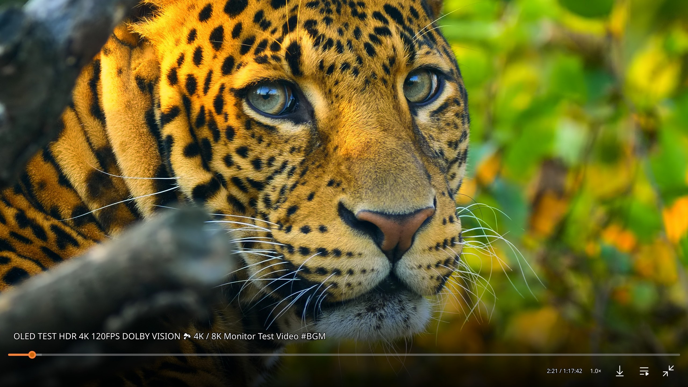
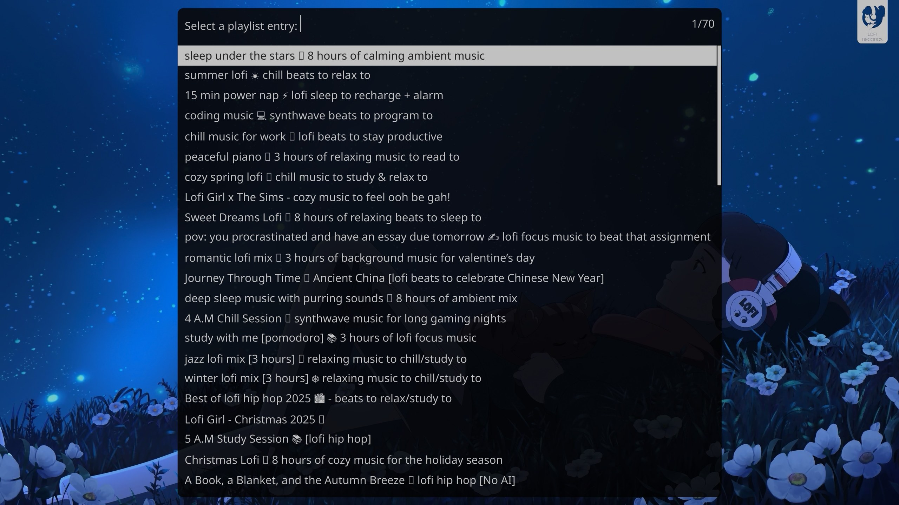
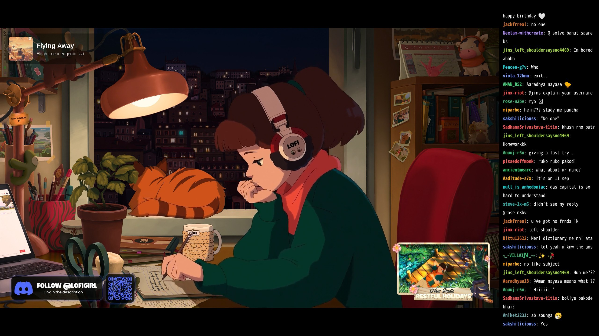
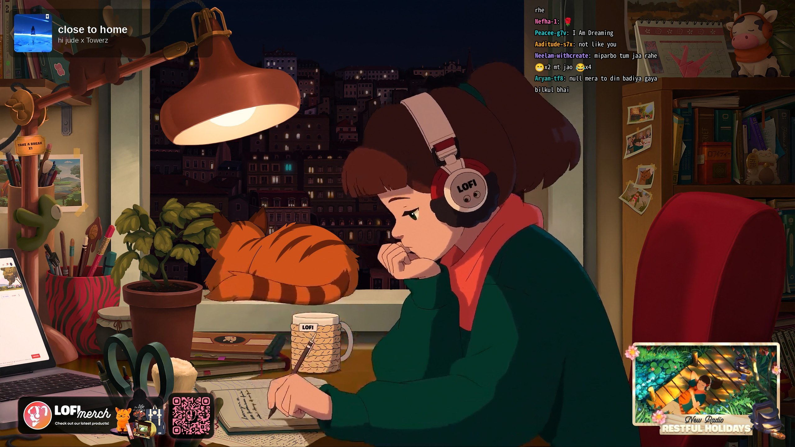
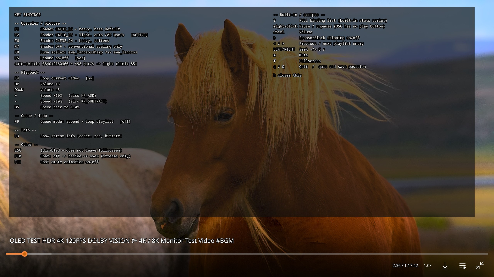

# mpv config

My everyday video player. It is one mpv process that plays local files, YouTube and Twitch,
upscales everything with a neural network shader on the GPU, remembers the volume of every
video I have ever watched, and paints live chat next to the picture while a stream plays. A
click on "Play in mpv" in the browser sends the page's video straight to it, and if no player
is running yet that click starts one.



**This is built for one person and one television.** Almost everything here follows my own
taste and my own hardware rather than any general idea of how a player should behave. The
shader that runs by default was chosen by watching two of them side by side on live action
YouTube and picking the one I preferred. The point at which the player quietly drops to a
lighter shader is a number I measured on an RTX 4080 SUPER, so it is wrong for your GPU. The
window opens fullscreen on the HDMI input my television sits on. The stream format string asks
for YouTube Premium enhanced bitrate, which does nothing without a Premium account. Short
videos never resume where I left them because my short videos are music videos. Take the
scripts, ignore the tuning, and throw away whatever does not suit you.

The seven Lua scripts and the four helper programs are the interesting part and none of them
exist anywhere else. Everything they need is written down below.

## What is here and what you have to fetch yourself

Only my own work is committed here, meaning the scripts, the key bindings and the settings
files. Two things have to be downloaded once before this config works completely.

```
mpv/
  mpv.conf            renderer, shader, cache, auth, window
  input.conf          every key binding
  scripts/            7 Lua scripts
  script-opts/        my ModernZ and thumbfast settings
  shaders/            EMPTY, drop the ArtCNN GLSL files in here
  fonts/              EMPTY, drop modernz-icons.ttf in here
bin/                  4 helper programs
config/
  ff2mpv-rust.json    the browser handoff glue
vendor/
  modernz.patch       my one change to the ModernZ source
docs/screenshots/     the pictures in this file
```

* **ArtCNN** from https://github.com/Artoriuz/ArtCNN, folder `GLSL`. Six files are referenced
  by name, `ArtCNN_C4F32_DS.glsl`, `ArtCNN_C4F16_DS.glsl`, `ArtCNN_C4F32_DN.glsl`,
  `ArtCNN_C4F16_DN.glsl`, `ArtCNN_C4F32.glsl` and `ArtCNN_C4F16.glsl`. They are about 3 MB and
  have not changed since early 2025.
* **ModernZ** from https://github.com/Samillion/ModernZ, which replaces mpv's own on screen
  controller. Copy its `modernz.lua` into `mpv/scripts/`, its icon font and its
  `modernz-locale.json` into `mpv/fonts/` and `mpv/script-opts/`, then apply
  `vendor/modernz.patch`, which is five lines and takes the play and pause button out of
  the compact layout, since a right click already pauses. The patch is written against version
  0.3.3 and you can simply skip it if you want the button.
  ModernZ has to live in the user config folder rather than being installed as a package,
  because mpv loads a script of the same name from both places and you end up with two
  controllers stacked on top of each other.

Programs that have to be present are `mpv`, `yt-dlp`, `socat`, `jq`, `python3`, `ffmpeg` for
emote decoding, `streamlink` with the `streamlink-ttvlol` plugin for Twitch, and
`ff2mpv-rust` for the browser handoff.

Two more mpv scripts are involved that are not mine and are not here, because both are
installed system wide by their own packages. **thumbfast** draws the preview thumbnail when
you hover the seek bar, and `mpv/script-opts/thumbfast.conf` is my override of its settings,
which turns previews on for network streams and starts the thumbnailer early so the first
hover is not empty. **sponsorblock_minimal** skips sponsor segments in YouTube videos and
answers the **b** key. Nothing breaks without them. You lose the previews and the skipping,
and the overlay slot that thumbfast reserves becomes one more emote.

## Sending a video from the browser

The browser side is the **ff2mpv** extension, which exists for Firefox on
https://addons.mozilla.org/firefox/addon/ff2mpv/ and for Chrome on
https://chromewebstore.google.com/detail/ff2mpv/ephjcajbkgplkjmelpglennepbpmdpjg. It adds a
"Play in mpv" entry to the context menu of any page, link or video. The extension cannot start
a program by itself, so it talks over Firefox's native messaging protocol to `ff2mpv-rust`,
which is a tiny native program installed system wide. A manifest at
`/usr/lib/mozilla/native-messaging-hosts/ff2mpv.json` is what allows the two to find each
other. Firefox, Zen and Floorp all read that same folder, so one manifest covers all of them.

`ff2mpv-rust` reads `config/ff2mpv-rust.json` and runs whatever `player_command` names. Here
that is not mpv but `bin/mpv-ff2mpv-single.sh`, and that script is where the actual behaviour
lives.

* **One player, not one per click.** The wrapper keeps an IPC socket in the runtime folder. If
  a player it started earlier is still alive it hands the new URL to that instance over the
  socket, so a second click swaps the video in the fullscreen window on the television instead
  of opening a second window somewhere. If nothing answers the socket it starts a fresh
  player. That is the automatic start.
* **YouTube URLs are rewritten before use.** mpv names its resume file after the MD5 of the
  exact URL string it was given, so `watch?v=X` and `watch?v=X&t=1s` are two different videos
  as far as resume is concerned. The browser hands over whatever the page had in its link, and
  YouTube's own "continue watching" shelf appends a `&t=` to every entry, which happens to
  every video this player touches because of the watch history ping described further down. So
  the wrapper rebuilds the URL from the video id alone and drops `&t=`, `&si=`, `&pp=`,
  `&index=` and `&ab_channel=`. The cost of this is that a timestamp somebody shared in a link
  no longer jumps to that timestamp.
* **Playlists are expanded, radio mixes are capped.** For a `watch?v=X&list=Y` URL mpv would
  normally load only the single clicked video. The wrapper expands the whole playlist and then
  a background job waits for the expansion to finish and jumps to the video that was actually
  clicked. YouTube's automatic radio mixes contain a thousand or more entries and extract very
  slowly, so those are cut off after 50.
* **Twitch goes through streamlink.** A Twitch URL is resolved to a direct HLS playlist by
  `streamlink` first and only then handed to mpv. With the `streamlink-ttvlol` plugin
  installed this also strips the ads that Twitch stitches into the stream itself, which no
  browser blocker can remove.



An expanded playlist is a real mpv playlist and nothing more, so everything mpv already does
with playlists applies. **g** then **p** opens the entry picker above, which is mpv's own and
searchable by typing, the controller gets its playlist button, and the previous and next keys
walk the list. The 70 entries in that picture came out of one click in the browser.

`bin/mpv-queue-toggle` exists so the queue mode described below can also be switched while the
browser has focus and the player is fullscreen on another screen. Bind it to a global desktop
shortcut. It prefers to hand the toggle to the running player over IPC so that there is only
one implementation of the state change, and falls back to writing the flag file itself when no
player is running.

## Live chat over the video



`scripts/chat_overlay.lua` draws the chat of a live stream or a recording as part of the video
output. **F10** cycles through three states, off, beside and over.

* **beside** shrinks the picture into the left part of the window and gives chat its own
  column, so nothing is covered.
* **over** leaves the picture at full size and puts a chat panel over the top right corner.



Three sources are supported and all three are normalised into one line based format by
`bin/mpv-chat-source` before the Lua side sees them. Twitch live chat is read from Twitch's
IRC gateway as an anonymous user, so no account and no token are involved. YouTube live chat
comes from the live chat track that `yt-dlp` can follow, tailed for as long as the stream runs.
For a YouTube recording the same track is replayed against the playback position, which means
chat scrolls in step with the video and seeking backwards works. Chat state follows the file
rather than the last key press, so opening something with no chat at all says so once and does
not leave a dead panel behind.

Emotes are real images, not names in brackets. Twitch native emotes plus 7TV, BTTV and FFZ,
YouTube channel emoji, and plain unicode emoji are all downloaded and decoded to raw frames by
`bin/mpv-chat-emote`, cached under the user cache folder, and composited into the text by
column. Animated emotes animate. Every frame of one emote lives in a single file because mpv's
overlay command takes a byte offset into a file, so showing the next frame is one command with
a different offset and no extra reads. **F11** turns the animation off, which is there to
measure what it costs.

Two limits are worth knowing about. mpv has exactly 64 overlay slots, numbered 0 to 63, and
one of them belongs to the thumbnail preview, so **63 emote images can be on screen at once**.
A busy panel wants far more than that, roughly 37 lines of nine emotes each in the beside
layout, which is why repeats of one emote are collapsed and slots are handed to the newest
messages first. An emote wall then runs out of images at the top of the panel rather than at
the freshest line. On top of that **one message may claim six image slots**, and anything past
that collapses into a single token that reads plus and a number.

The chat font is a monospace face that covers Latin and
Japanese in one file, because emote images are positioned by counting character cells, and the
usual monospace font silently falls back to a proportional face for Japanese, which drifts
emotes further off centre with every character. And the panel reads the margins that ModernZ
publishes while the controller is visible, so an emote never ends up sitting under the seek
bar.

## The upscaler and its pixel budget

An ArtCNN pass costs a fixed amount of work per source pixel and has to be paid once per
frame, so what decides whether the heavy model keeps up is the source pixel rate, meaning
width times height times frame rate. This is why 1080p60 struggles while 1080p30 is
comfortable. Same pixels, twice the rate.

`mpv.conf` therefore loads the heavy `C4F32_DS` model by default and carries a profile that
switches to the lighter `C4F16_DS` for any file above 85 megapixels per second. Everything at
or above 1080p50 and 1440p24 lands on the light model.

**That threshold is measured, not chosen.** On my card 1080p60 is 124 megapixels per second
and renders at roughly 53 of 60 frames, so the heavy model's sustained ceiling sits near 110.
The threshold is set well below that to leave room for debanding, the scaler passes and HDR
tone mapping, none of which were part of that measurement. To find your own number, play a
1080p60 video with the heavy model forced, watch the dropped frame counter in mpv's own
statistics, and work down from the pixel rate at which it stops dropping. Then change the
number in three places, the profile condition in `mpv/mpv.conf`, the labels in
`mpv/input.conf`, and `PIXEL_RATE_LIMIT` in `mpv/scripts/keyhelp.lua`. A Lua script cannot
read a profile condition and a profile condition cannot call Lua, so those two really are
separate copies of the same number.

Debanding is on with a low grain setting. It repairs a completely different artefact than the
shader does. The shader rebuilds edges and detail, debanding fixes the stepped gradients that
compression leaves in skies and dark scenes, and 8 bit banding survives even a high bitrate
stream once the picture is dark enough.

## Key bindings



**h** opens the cheat sheet above. It is drawn by `scripts/keyhelp.lua`, which **parses
`input.conf` at startup**, so a binding added there appears in the sheet by itself. Giving it
a friendly label is a one line addition to a table in the script. Pressing **?**, which is
mpv's own default binding and not something this config sets, still brings up the statistics
script's complete raw list of every binding that exists.

The sheet reports rather than asserts. Each shader row carries a live marker showing which
model is actually loaded right now, because the automatic switch means the default key is not
what is playing on most files, and a footnote states the current file's pixel rate against the
threshold. Both update while the sheet is open.

| Key | What it does |
|---|---|
| F1 | Heavy shader, sharpening variant. The base default |
| F2 | Light shader, sharpening variant. What the automatic switch picks |
| F6 | Heavy shader, softening variant |
| F7 | No neural shader at all, conventional scaling only. The honest baseline |
| F8 | Toggle the luma scaler between two variants, independent of the shader keys |
| F5 | Toggle debanding for a comparison |
| F3 | Print format, codec, resolution, frame rate, bitrate and active shader |
| F4 | Loop the current file |
| F9 | Queue mode |
| F10 | Chat overlay, off then beside then over |
| F11 | Emote animation |
| h | This cheat sheet |
| Up and Down | Volume, replacing the default long seek |
| Plus and Minus | Playback speed, also on the numeric keypad |
| Backspace | Back to normal speed |

Escape is deliberately disabled so that a stray press cannot drop the player out of
fullscreen.

The right hand column of the sheet is mpv's own keys rather than anything this config sets,
kept there so that one screen answers every question. It covers the seek keys, mute,
fullscreen, quitting with and without saving the position, the playlist keys, volume on the
mouse wheel, pause on a right click, since the controller has no pause button any more, and
**b** for sponsor segment skipping.

## Queue mode

**F9**, from `scripts/queue_mode.lua`. Off, which is the default, a click in the browser
replaces whatever is playing. On, a click appends to the playlist instead and the playlist
loops forever, so clicks stack up into a queue rather than interrupting each other.

This is what I use for music. Collect however many videos I feel like, let them run, and have
the whole thing start over at the end instead of stopping.

The state lives in a flag file rather than inside the player, for two reasons. The browser
wrapper has to know the mode before it decides how to hand a URL over, and a player started
fresh while queue mode is on has to come up already looping. Turning queue mode on also clears
a single file loop if one is active, because looping one file forever means the playlist never
advances and queue mode would silently do nothing.

## Per video volume

`scripts/volume_per_file.lua` remembers the volume of every video separately. mpv looks like
it already does this but it does not, for two measured reasons.

A file that reaches its end stores nothing at all. mpv writes a resume file only for whatever
was playing when it quit, and a finished file is considered done and dropped, so a music video
never kept its volume. And volume is a global property, so it leaks into whatever plays next.
Both were measured. A two entry playlist advancing on its own started the second file at the
first file's setting, and a browser handoff mid playback did the same.

One file per video is stored under the XDG state folder, holding nothing but the number. The
names are readable with a short hash suffix, so an entry can be found and deleted by hand and
that video then forgets. Volume is removed from mpv's own resume options so that there is one
writer instead of two, while values already written by the old behaviour are still picked up
once as a free migration. Writes are coalesced, because one scroll of the wheel produces a
property event per tick.

## Smaller scripts

* **`scripts/restart-short-videos.lua`** turns off resume for anything shorter than ten
  minutes. Resume is on for everything else. A music video should start at the beginning.
* **`scripts/ytdl_fail_notice.lua`** turns a `yt-dlp` failure into a readable message on screen
  and a desktop notification instead of the player exiting. It exists for one specific case.
  YouTube keeps a finished livestream as thousands of two second chunks for a while, `yt-dlp`'s
  metadata for such a video is then larger than the 64 MiB that mpv is willing to read from a
  subprocess, the JSON arrives truncated and mpv gives up and quits. The script recognises the
  truncation, explains that YouTube converts these into normal videos on its own after a
  while, and keeps the player alive on the file that was working.
* **`scripts/modernz-audio-button-auto.lua`** hides the audio track button on the controller
  unless the file actually has more than one audio track. ModernZ rereads its options at
  runtime, so the button appears and the controller relayouts live.

## YouTube Premium and the browser profile

Authentication is read live out of a browser profile on every play, which is the part of this
config I would recommend to anyone.

`ytdl-raw-options` points `yt-dlp` at a symlink named `browser-profile` inside the mpv config
folder, and that symlink points at the profile of whichever browser I actually browse in.
YouTube authentication is a long lived cookie plus a short lived token that the server rotates
every few hours. An exported cookie file freezes that token, so it is rejected within hours
and the player looks logged out. Reading the profile database directly picks up whatever the
browser last refreshed, so it never expires while the browser stays logged in. Switching
browsers is one `ln -sfn` and `mpv.conf` never changes. It only works with Firefox and its
forks, because their cookie database is a plain unencrypted file that can be copied while the
browser runs.

The symlink has to point at the profile that is genuinely being used. Pointing it at an
abandoned profile does not fail, it works for days and then rots, because nothing refreshes
the rotating token in a profile nobody browses in.

`mark-watched` is set alongside it, which makes `yt-dlp` send the playback ping that puts the
video into the YouTube watch history. Cookies alone do not do that, because history is
normally written by the web player's own beacons which a command line tool never sends, and
without it the recommendations on the website slowly stop reflecting what was actually
watched. The flag marks a video as seen at load time and carries no watch position.

`ytdl-format` asks for the Premium enhanced bitrate track by its format note across every
codec, and falls back to the best normal track. Without a Premium account it simply always
takes the fallback.

## The rest of mpv.conf

The renderer is `gpu-next` on Vulkan with hardware decoding left on automatic, because pinning
it to Vulkan silently failed for AV1 and fell back to sixteen software threads at 4K.
Tone mapping is left to handle HDR natively with no fake expansion of SDR content, and
saturation is nudged up slightly for how HDR looks in this Wayland session.

The demuxer cache is set to 3 GiB in each direction. The backward half is the one that
matters, because that is what gets thrown away when seeking back or looping, and throwing it
away means downloading the video again. **That is an huge amount for a video player** and I
know it. I have enough memory that paying for it costs me nothing while jumping
around a long video stays instant. If your memory is more contested, turn both numbers down.
The defaults are 150 MiB forward and 50 MiB back, and anything in between works fine.

Resume files record the source URL as a comment inside themselves, because they are named
after a hash and are otherwise impossible to tell apart. Four options are excluded from resume,
each on its own line, which matters more than it looks. Given a comma separated list mpv looks
the whole string up as one option name, finds nothing, and silently removes nothing at all.

The window opens fullscreen on the HDMI output the television is connected to.

## Installing

```
git clone https://github.com/Tobias2909/mpv-config ~/mpv-config
cd ~/mpv-config
ln -s ~/mpv-config/mpv ~/.config/mpv
ln -s ~/mpv-config/bin/* ~/.local/bin/
ln -s ~/mpv-config/config/ff2mpv-rust.json ~/.config/ff2mpv-rust.json
```

Then fetch ArtCNN and ModernZ as described at the top, create the browser profile symlink, and
edit the three lines listed below.

Symlinks rather than copies, because that is how I run it myself. This clone **is** my live
configuration, so editing a script and committing it are the same act and the two can never
drift apart. That is also why the ignore file names the shaders, the controller and the
browser profile symlink. They live inside the clone but are either downloads or specific to
one machine, so none of them belong in a commit.

Three things in `mpv/mpv.conf` name my machine and need changing.

```
ytdl-raw-options=cookies-from-browser=firefox:/home/<you>/.config/mpv/browser-profile
screen-name=HDMI-A-1
fs-screen-name=HDMI-A-1
```

The cookie path has to be absolute. `yt-dlp` hands that string on without expanding a tilde and
without looking at your home folder, so there is no portable way to write it. The two screen
options can simply be deleted if you do not want a fixed screen. The same applies to
`player_command` in `config/ff2mpv-rust.json`.

The `browser-profile` symlink itself is not in the repo, since it points into a browser
profile that only exists on my machine. Create it yourself.

```
ln -sfn "/path/to/your/firefox/profile" ~/.config/mpv/browser-profile
```

## What is worth stealing

If you are here for parts rather than the whole thing, these work anywhere with no changes.

* `scripts/chat_overlay.lua` with `bin/mpv-chat-source` and `bin/mpv-chat-emote`
* `scripts/volume_per_file.lua`
* `scripts/ytdl_fail_notice.lua`
* `scripts/restart-short-videos.lua`
* `scripts/modernz-audio-button-auto.lua`

These are useful as a pattern but are tied to how I have things set up.

* `scripts/keyhelp.lua`, which adapts to your `input.conf` on its own but names my shaders
* `bin/mpv-ff2mpv-single.sh` and `bin/mpv-queue-toggle` with `scripts/queue_mode.lua`

And these are measurements of my hardware, not settings.

* The 85 megapixels per second threshold and everything around it
* The colour, HDR and screen options in `mpv.conf`

## Credits

ArtCNN by Joao Chrisostomo and Kacper Michajłow, MIT licensed. ModernZ by Samillion, which
descends from mpv's own on screen controller and is LGPL 2.1 licensed, included here only as a
patch against its source. ff2mpv by William Woodruff. streamlink and the TTV LOL plugin.
`yt-dlp`. Everything written by me in this repository is MIT licensed, see `LICENSE`.
