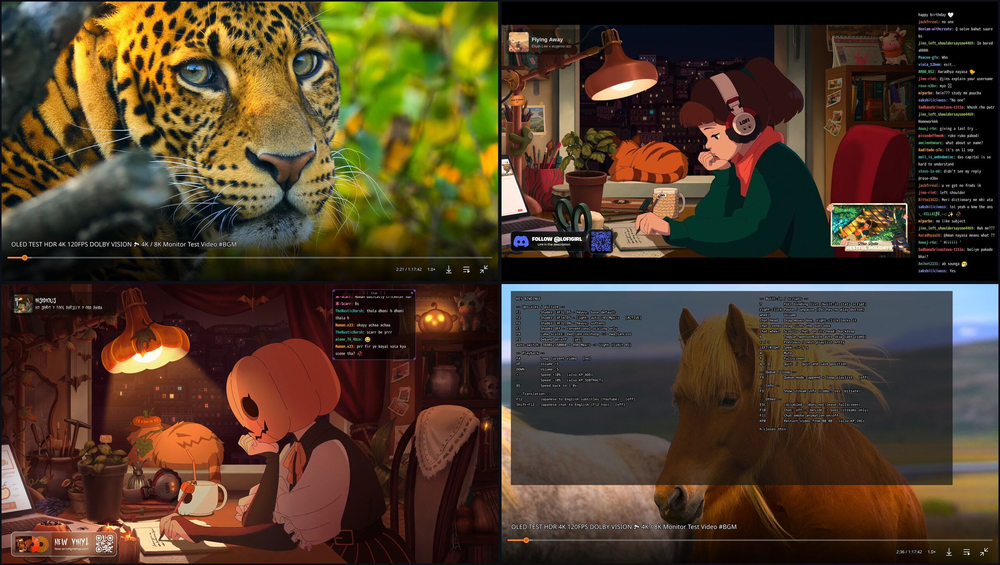

# mpv config

My everyday video player for local files, YouTube and Twitch. A click on "Play in mpv" in the
browser sends the video to one running player, which upscales it with a neural network shader
on the GPU, shows live chat next to or over the picture, and can turn Japanese speech into
English subtitles without anything leaving the machine.

In my setup most videos come from [Weave](https://github.com/Tobias2909/Weave), my YouTube and
Twitch client, which sends them through the same ff2mpv wrapper as the browser and marks them
watched by listening to the player, and everything here works the same without it.

It is tuned for one RTX 4080 SUPER and one 4K television, so take the scripts and ignore the
tuning.



## Features

* **AI upscaling** with ArtCNN. A heavy model by default, switched to a light one above 85
  megapixels per second so 1080p60 never drops frames
* **Browser handoff** through ff2mpv. A click swaps the video in the running player or starts a
  new one
* **YouTube links cleaned** so resume always finds a video again, whole playlists expanded,
  radio mixes cut at 50 entries
* **Twitch through streamlink** with the ttvlol plugin, so stitched in ads are gone, titled with
  channel, stream title and category
* **Live chat** from Twitch and YouTube, also replayed in step with a YouTube recording. Shown
  beside the video or in a box that you drag, size and lock with the mouse (F10)
* **Real emotes** from Twitch, 7TV, BTTV, FFZ and YouTube, animated
* **Japanese to English subtitles** recognised and translated locally on the GPU, ahead of the
  playback position (F12)
* **Japanese chat in English** while it scrolls (Shift+F12). Video titles are translated too
* **SponsorBlock** skips sponsors and intros and marks every other segment on the seek bar. The
  server never learns which video is playing
* **Per video volume** remembered for every video, and a fresh player starts at the last volume
* **Queue mode** (F9) makes browser clicks stack up into a looping playlist instead of
  replacing the video
* **Key cheat sheet** on h, read from `input.conf`, showing which shader is really active
* **YouTube Premium** enhanced bitrate, with cookies read live from the browser profile so the
  login never expires, and watched videos land in the YouTube history
* **Instant seek bar previews** in the ModernZ controller, made ahead of time from the
  cache and from YouTube storyboards, so hovering never waits for a download
* Videos under ten minutes always start from the beginning
* A failed `yt-dlp` load is explained on screen instead of closing the player
* Debanding, `gpu-next` on Vulkan and HDR passthrough

## Install

Needs `mpv`, `yt-dlp`, `ffmpeg`, `curl`, `socat`, `jq`, `python3`, `streamlink` with
`streamlink-ttvlol`, `ff2mpv-rust` and the ff2mpv extension for
[Firefox](https://addons.mozilla.org/firefox/addon/ff2mpv/) or
[Chrome](https://chromewebstore.google.com/detail/ff2mpv/ephjcajbkgplkjmelpglennepbpmdpjg).

```
git clone https://github.com/Tobias2909/mpv-config ~/mpv-config
ln -s ~/mpv-config/mpv ~/.config/mpv
ln -s ~/mpv-config/bin/* ~/.local/bin/
ln -s ~/mpv-config/config/ff2mpv-rust.json ~/.config/ff2mpv-rust.json
```

Then

1. Put the six files from the `GLSL` folder of [ArtCNN](https://github.com/Artoriuz/ArtCNN)
   into `mpv/shaders/`.
2. Get [ModernZ](https://github.com/Samillion/ModernZ) 0.3.3. Put `modernz.lua` into
   `mpv/scripts/`, its icon font into `mpv/fonts/` and `modernz-locale.json` into
   `mpv/script-opts/`, then apply the patch.
   ```
   patch -p1 -d ~/mpv-config/mpv/scripts < ~/mpv-config/vendor/modernz.patch
   ```
3. Point the cookie link at the profile of the Firefox based browser you are logged in with.
   ```
   ln -sfn "/path/to/your/firefox/profile" ~/.config/mpv/browser-profile
   ```
4. Change the lines that name my machine. The cookie path has to stay absolute because
   `yt-dlp` does not expand a tilde.
   ```
   mpv/mpv.conf                 ytdl-raw-options, screen-name, fs-screen-name
   config/ff2mpv-rust.json      player_command
   ```
5. On a weaker GPU lower `85000000` in `mpv/mpv.conf` and `PIXEL_RATE_LIMIT` in
   `mpv/scripts/keyhelp.lua`.
6. Optional, for the Japanese features. Run `bin/mpv-translate-setup` once. It downloads about
   7 GB into `~/.local/share/mpv-translate` and the model cache.

## License

MIT, see `LICENSE`. ArtCNN (MIT) and ModernZ (LGPL 2.1) are not included, ModernZ only as a
patch against its source. Segment data comes from the SponsorBlock project.
